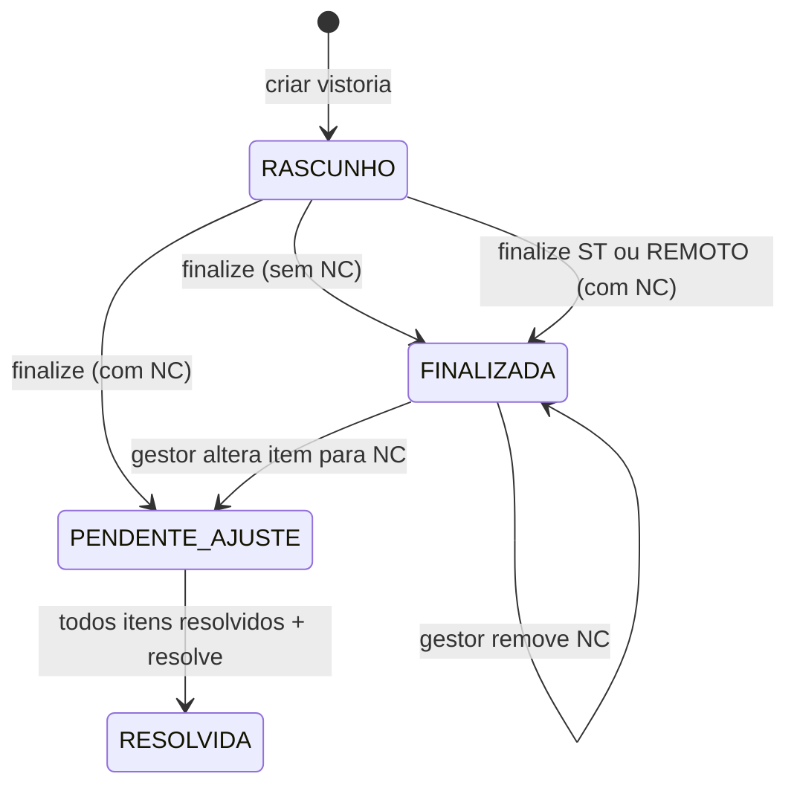

# Domínio — Sanorte Vistorias (Frontend)

Referência do **modelo de domínio** e das **regras de negócio** espelhadas no client. Código-fonte em `src/domain/`.

A autoridade final das regras persistidas está no backend (`sanorte-vistorias-backend`). O frontend valida antes de enviar e calcula previews locais — divergências devem ser corrigidas em ambos os lados.

---

## Estrutura

```
src/domain/
├── enums.ts              Enums compartilhados com a API
├── types.ts              Entidades e DTOs tipados
├── pagination.ts         Tipos de paginação
├── photoLimits.ts        Limites de evidências fotográficas
├── rules.ts              Re-export das regras
└── rules/
    ├── validateFinalize.ts   Validação pré-finalização
    └── calculateScore.ts     Cálculo de nota percentual
```

Alinhamento com backend: enums e tipos devem corresponder a `sanorte-vistorias-backend/src/common/enums/` e payloads documentados em `API_DOCUMENTATION.md`.

---

## Enums

### `ModuleType`

Módulo operacional da vistoria.

| Valor | Uso |
|-------|-----|
| `CAMPO` | Vistorias de campo |
| `REMOTO` | Vistorias remotas — sem exigência de foto em NC; assinatura opcional |
| `POS_OBRA` | Pós-obra — assinatura opcional no client |
| `SEGURANCA_TRABALHO` | Segurança do Trabalho — `teamId` opcional; não gera pendência |
| `OBRAS_INVESTIMENTO` | Vistorias vinculadas a obras de investimento |

### `UserRole`

| Valor | Comportamento na UI |
|-------|---------------------|
| `ADMIN` | Acesso total; CRUD de cadastros |
| `GESTOR` | Gestão, dashboards, vistorias (exceto rascunho de fiscal) |
| `SUPERVISOR` | Similar ao gestor, com restrições de menu |
| `FISCAL` | Execução em campo; redirecionado para `/inspections/mine`; edita só `RASCUNHO` |

### `InspectionStatus`

```
RASCUNHO → FINALIZADA | PENDENTE_AJUSTE → RESOLVIDA
```

| Status | Significado |
|--------|-------------|
| `RASCUNHO` | Em preenchimento pelo fiscal |
| `FINALIZADA` | Concluída sem pendências (ou ST/REMOTO com NC) |
| `PENDENTE_AJUSTE` | Possui itens `NAO_CONFORME` aguardando resolução |
| `RESOLVIDA` | Todas as pendências foram resolvidas |

### `ChecklistAnswer`

| Valor | Efeito na nota |
|-------|----------------|
| `CONFORME` | Conta como conforme |
| `NAO_CONFORME` | Conta como não conforme; pode gerar pendência |
| `NAO_APLICAVEL` | Excluído do cálculo de nota |

### `InspectionScope`

| Valor | Descrição |
|-------|-----------|
| `TEAM` | Vistoria por equipe (padrão) |
| `COLLABORATOR` | Vistoria por colaborador |

### `InvestmentWorkStatus`

`EM_ANDAMENTO` | `PARALISADA` | `FINALIZADA` | `CANCELADA`

---

## Entidades principais (`types.ts`)

### Cadastros

| Tipo | Campos relevantes |
|------|-------------------|
| `User` | `role`, `contractIds` — escopo de acesso por contrato |
| `Team` | `isContractor` — equipe empreiteira não aceita colaboradores vinculados |
| `Sector` | Setor operacional (ESGOTO, AGUA, REPOSICAO, etc.) |
| `Collaborator` | Vinculado a `sectorId` e opcionalmente `contractId` |
| `Contract` | Agrupa equipes, usuários e ordens de serviço |
| `Checklist` | `module`, `inspectionScope`, `sectorId`, `sections[]` |
| `ChecklistItem` | `requiresPhotoOnNonConformity`, `referenceImageUrl` |
| `ServiceOrder` | OS vinculável à vistoria (`osNumber`, `sectorId`, flags de módulo) |
| `InvestmentWork` | Obra de investimento com `status`, `teamId`, `inspectionStats` |

### Vistoria

| Tipo | Uso |
|------|-----|
| `InspectionListItem` | Payload enxuto de listagens |
| `Inspection` | Detalhe completo — `externalId` (rota), `serverId` (id interno) |
| `InspectionItem` | Resposta por item do checklist; `resolvedAt` quando pendência resolvida |
| `Evidence` | Foto vinculada a item ou geral; URL Cloudinary |
| `Signature` | Assinatura do líder/encarregado |

### Relatórios de engenharia

| Tipo | Descrição |
|------|-----------|
| `ReportType` | Template de relatório (`orientation`: RETRATO \| PAISAGEM) |
| `ReportTypeField` | Campo dinâmico (`ReportFieldType`) |

### Paginação

`PaginatedResponse<T>` = `{ data: T[], meta: PaginationMeta }`

---

## Regras de negócio (`rules/`)

### Cálculo de nota — `calculateScore`

```
nota_base = (conformes / itens_avaliados) × 100
```

- Itens **avaliados**: todos com resposta diferente de `NAO_APLICAVEL`
- Se nenhum item avaliado → retorna **100**
- Arredondamento: `Math.round` (inteiro)

A penalidade de paralisação (25%) é aplicada **no backend** sobre `scorePercent`. O frontend usa `calculateScore` apenas para preview; o valor persistido vem da API.

### Finalização — `validateFinalize`

Validação client-side antes de `POST /inspections/:id/finalize`:

| Regra | Condição |
|-------|----------|
| Assinatura obrigatória | Todos os módulos **exceto** `REMOTO`, `SEGURANCA_TRABALHO` e `POS_OBRA` |
| Respostas completas | Todo item ativo do checklist deve ter resposta |
| Evidência em NC | Para módulos ≠ `REMOTO`: item `NAO_CONFORME` com `requiresPhotoOnNonConformity = true` exige evidência vinculada |

**Nota:** o backend não rejeita finalização por ausência de assinatura — a validação de assinatura é responsabilidade do client. Evidências obrigatórias são validadas em ambos os lados.

### Limites de fotos — `photoLimits.ts`

| Constante | Valor |
|-----------|-------|
| `MAX_PHOTOS_PER_CHECKLIST_ITEM` | 2 evidências por item |
| `MAX_GENERAL_INSPECTION_PHOTOS` | 5 fotos gerais (sem `inspectionItemId`) |

---

## Fluxos de domínio (visão do client)

### Ciclo de vida da vistoria



Exceções por módulo:

- **SEGURANCA_TRABALHO** e **REMOTO**: `resolveFinalStatus` no backend sempre retorna `FINALIZADA`, mesmo com `NAO_CONFORME`
- **SEGURANCA_TRABALHO**: `teamId` opcional na criação

### Paralisação

- Motivo obrigatório ao paralisar
- Penalidade persistente de **25%** na nota (`scorePercent × 0.75`)
- Removível via `unparalyze` (GESTOR, SUPERVISOR, ADMIN)

### Pendências

1. Item `NAO_CONFORME` em vistoria `PENDENTE_AJUSTE`
2. Resolução individual: `POST .../items/:itemId/resolve` (notas + evidência)
3. Conclusão: `POST .../resolve` → status `RESOLVIDA` (somente quando todos os itens NC tiverem `resolvedAt`)

### Identificadores

| Campo | Origem | Uso |
|-------|--------|-----|
| `externalId` | Gerado no client (UUID) | Rota `/inspections/:externalId/...`; chave de sync offline |
| `serverId` / `id` | Backend | Operações internas após normalização em `AppRepository` |

---

## Regras de cadastro (refletidas na UI)

- Setores padrão (seed): `ESGOTO`, `AGUA`, `REPOSICAO`
- Checklist com `inspectionScope` padrão `TEAM`
- Equipe empreiteira (`isContractor = true`) não permite colaboradores vinculados
- `serviceDescription` obrigatório exceto para módulo `REMOTO`

---

## Onde alterar

| Mudança | Arquivo(s) |
|---------|------------|
| Novo enum | `enums.ts` + backend `common/enums/` |
| Novo tipo de entidade | `types.ts` |
| Regra de finalização | `rules/validateFinalize.ts` + backend `inspections.service.ts` |
| Cálculo de nota | `rules/calculateScore.ts` + backend `inspection-domain.service.ts` |
| Limite de fotos | `photoLimits.ts` + validação no backend/uploads |

---

## Referências

- Regras server-side completas: `sanorte-vistorias-backend/DOMAIN.md`
- Payloads de API: `API_DOCUMENTATION.md`
- Arquitetura do client: `ARCHITECTURE.md`
